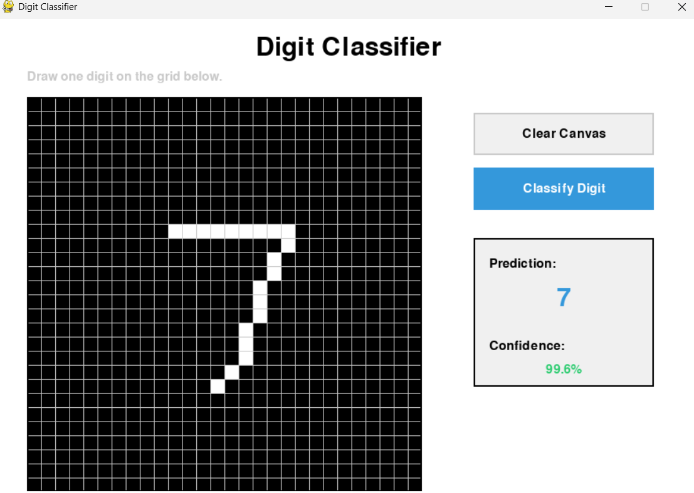

# MNIST Digit Classifier

This is a Digit Classifier AI using PyTorch.

To make the AI first install the required dependencies.

```bash
pip install -r requirements.txt
```

After installing just make a folder inside the project directory named `data`.
```bash
mkdir data
```


Download the dataset from MNSIT

```bash
python download.py
```

Train the model

```bash
python model.py
```

Use the UI
```bash
python gui.py
```


